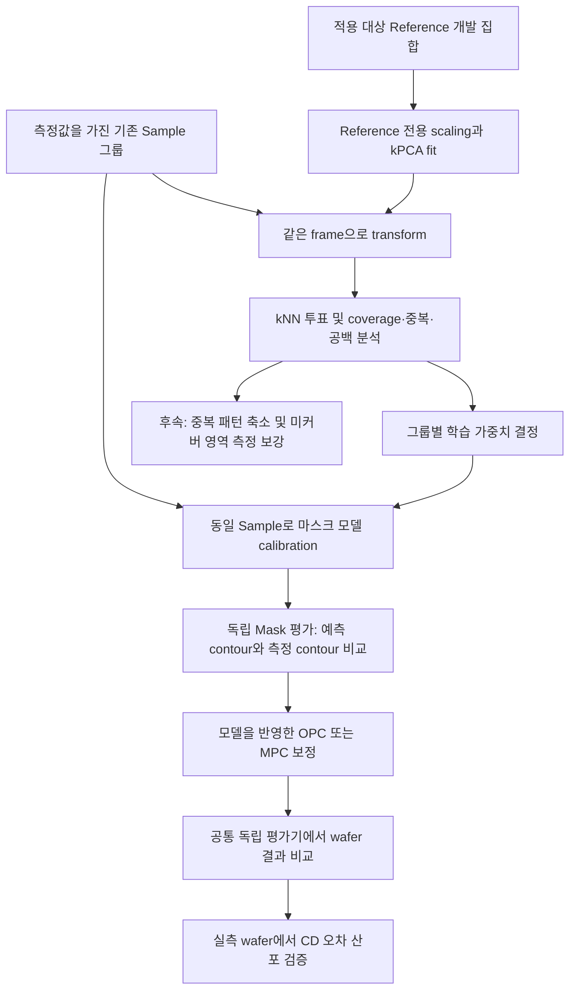

# 마스크 모사 정확도와 wafer 패턴 산포 개선을 위한 Reference 기반 그룹 가중 학습

**기술 보고서 초안 v0.1 · 실험 설계 및 결과 작성안**  
작성일: 2026-09-10  
기준: [CLAIM_STRATEGY.md](CLAIM_STRATEGY.md), 분석 코드 커밋 `18d2535`  
문서 상태: 실제 Mask/wafer 성능 결과는 아직 입력되지 않았다. 아래의 개선 효과는 검증할 가설이며, 결과 표의 `미측정`은 실험 후 실제 값으로 교체한다.

## 요약

본 기술은 모델이 적용될 Reference 패턴 분포를 기준으로 기존 학습 패턴의 연관도와 대표성을 분석하고, 이를 마스크 공정 모델의 그룹별 학습 가중치로 연결하는 방법이다. Reference만으로 학습한 RBF Kernel PCA(kPCA) 공간에서 각 Reference 패턴과 Sample 패턴의 관계를 계산한다. 최근접 top-K 역거리 투표로 그룹별 연관도를 산출하고, 고정 반경 coverage 및 그룹 제거 시 coverage 손실로 대표성과 중복을 함께 진단한다.

첫 실험에서는 기존 학습 패턴을 모두 유지하고 가중치만 변경한다. 이후 독립 평가 패턴에서 마스크 contour와 CD의 예측 정확도를 확인하고, 개선 모델을 반영한 OPC/MPC 보정 결과가 wafer 패턴의 목표 CD 대비 오차 산포를 줄이는지 평가한다. 가중치 효과가 확인된 뒤에만 중복 패턴 축소와 미커버 영역의 데이터 보강을 별도 실험으로 수행한다.

이 연구가 검증하려는 성과는 **“Reference에 맞춘 학습 데이터 활용 → 마스크 형상의 모사 정확도 개선 → 보정 결과 개선 → wafer 패턴 오차 산포 감소”**다. 현재 구현된 기하학 분석은 이 연결의 출발점이며, 물리적 성능 개선은 독립적인 Mask/wafer 평가로 입증한다.

## 1. 서론

반도체 패턴의 설계 의도를 wafer에 구현하려면 보정 과정에서 사용하는 모델이 실제 공정의 형상 변화를 충분히 표현해야 한다. 특히 마스크 제작 과정에서 발생하는 형상 변화는 설계 도형과 실제 마스크 contour 사이의 차이로 나타나므로, CD뿐 아니라 2차원 형상을 이용한 모델 보정과 검증이 필요하다. Contour 기반 마스크 모델링은 이러한 형상 충실도를 평가하고 모델에 반영하는 접근으로 연구되어 왔다. [Vasek 등의 연구](https://www.researchgate.net/publication/252431892_SEM-contour_based_mask_modeling_-_art_no_69244Q)

마스크 형상의 예측 정확도는 wafer 영상과 보정 결과를 해석하는 데 중요한 입력이다. 실제 마스크의 CD, corner rounding 및 contour를 정량화하고, 마스크 형상 차이가 wafer printing에 미치는 영향을 비교하는 연구도 보고되어 있다. 이러한 배경은 마스크 모델의 예측 오차를 낮추는 일이 wafer 패턴 품질 개선에 기여할 수 있다는 연구 가설을 뒷받침한다. 다만 그 효과의 크기와 발생 조건은 대상 공정에서 별도로 확인해야 한다. [Zimmermann 등의 연구](https://nanolithography.spiedigitallibrary.org/conference-proceedings-of-spie/12802/128020J/Efficient-mask-characterization-through-automated-contour-and-corner-rounding-extraction/10.1117/12.2675486.short)

본 연구는 모델의 구조를 변경하기 전에 **어떤 패턴 정보를 어떤 비중으로 학습시킬 것인가**에 주목한다. 기존에 확보한 Sample은 측정 편의, 패턴 종류, 개발 이력 등에 따라 구성되므로, 실제 적용 대상인 Reference의 분포와 차이가 있을 수 있다. 이 경우 학습 데이터의 평균 오차가 작더라도 실제 적용 영역에서 모델의 일반화 성능이 충분하지 않을 수 있다는 것이 본 연구의 문제 설정이다.

이를 해결하기 위해 Reference를 고정된 비교 기준으로 삼고 Sample의 개별 패턴과 그룹을 평가한다. 분석 결과는 그룹별 학습 가중치, 유지할 패턴, 후속 측정이 필요한 영역을 결정하는 근거로 사용한다. 최종 평가는 기하학적 coverage 수치에서 끝내지 않고, 마스크 모사 성능과 보정 후 wafer 오차 분포까지 이어진다.

## 2. 이 기술이 필요한 이유

### 2.1 데이터 개수와 적용 대상의 대표성은 별도로 평가해야 한다

측정 데이터를 많이 확보하는 일과 실제 제품 패턴을 잘 대표하는 일 사이에는 측정 비용과 모델 품질의 균형이 필요하다. 실제로 OPC calibration용 test pattern 선택과 자동 sample plan 최적화는 이미 연구된 주제다. 본 기술 역시 패턴 수 자체보다 적용 대상과 학습 데이터 사이의 관계를 명시적으로 평가하는 데서 출발한다. [IBM의 test pattern 선택 연구](https://research.ibm.com/publications/the-feasibility-of-using-image-parameters-for-test-pattern-selection-during-opc-model-calibration), [자동 sample plan 연구](https://research.ibm.com/publications/automated-sample-plan-selection-for-opc-modeling)

본 연구에서 해결하려는 실무 문제는 세 가지다. 첫째, 비슷한 패턴이 많은 집단은 학습에 반복적으로 반영되는 반면 적용 대상의 일부 영역은 상대적으로 약하게 학습될 수 있다. 둘째, Sample 내부의 군집만 살펴보면 그 군집이 Reference의 어느 영역과 연관되는지 판단하기 어렵다. 셋째, 특정 그룹의 전체 coverage가 높더라도 다른 그룹과 대부분 중복된다면 그 그룹의 제거 영향은 작을 수 있다.

따라서 총 연관도, 패턴당 연관도, 독립적인 coverage 기여를 함께 보아야 한다. 하나의 순위만으로 유지·삭제·보강을 결정하지 않고, 각 지표가 답하는 질문을 구분한다.

### 2.2 비선형 표현공간의 효용도 검증 대상이다

다차원 feature의 관계를 저차원으로 표현하면 패턴 분포와 빈 영역을 시각적으로 이해하기 쉽다. kPCA는 kernel을 이용해 비선형 주성분을 계산하는 기존 방법이며, 본 연구에서는 Reference와 Sample을 비교하기 위한 표현공간으로 사용한다. [Schölkopf 등의 kPCA 원 논문](https://pure.korea.ac.kr/en/publications/nonlinear-component-analysis-as-a-kernel-eigenvalue-problem/)

kPCA를 사용했다는 사실만으로 원본 feature 거리나 선형 PCA보다 좋은 물리적 분류가 보장되지는 않는다. 유지한 kernel 분산 질량, 축에 따른 원본 feature 변화, 차원 수와 kernel parameter 변화에 따른 순위 안정성을 점검하고, 최종적으로 동일한 Mask/wafer 평가에서 유용성을 확인한다.

### 2.3 학습 가중치 변경과 데이터 제거 효과를 구분해야 한다

처음부터 낮은 순위 패턴을 제거하면 성능 변화의 원인이 학습 비중 조정인지, 데이터 수 감소인지 구분하기 어렵다. 이에 따라 [기존 실험 전략](CLAIM_STRATEGY.md)은 전체 Sample을 유지한 그룹 가중 학습을 첫 단계로 제안한다. 본 보고서는 이 원칙을 따른다.

첫 단계의 기대효과는 기존 데이터를 더 적합한 비중으로 활용하는 것이다. 학습 패턴 수와 좌표가 같으면 고정 R에서의 기하학적 coverage도 그대로다. **이 단계의 성공 기준은 coverage 증가가 아니라 독립 평가에서의 예측 오차 감소**다. 데이터 축소에 따른 비용 절감은 후속 단계의 별도 성과로 평가한다.

## 3. 제안 기술과 데이터 활용 방법

### 3.1 전체 흐름

Mask 평가와 wafer 평가는 서로 다른 질문에 답한다. 전자는 모델이 실제 마스크를 얼마나 정확히 예측하는지, 후자는 그 모델을 이용한 보정 결과가 실제 목표 wafer 패턴에 얼마나 가까운지를 평가한다.

### 3.2 데이터 정의와 분리

| 데이터 | 목적 | 사용 원칙 |
|---|---|---|
| Reference 개발 집합 $R_{dev}$ | 적용 대상 분포 정의, frame fit, 연관도 계산 | 실제 적용 범위를 대표하는 패턴에서 추출 |
| Sample 학습 집합 $S$ | 마스크 공정 모델 calibration | Feature, 그룹, pattern ID, mask 측정값을 연결 |
| 개발 검증 집합 $V$ | 가중치 완화 정도와 분석 설정 선택 | 최종 평가 집합과 분리 |
| Mask 최종 평가 집합 $H_M$ | 독립 마스크 예측 정확도 평가 | Frame fit, 가중치 산출, model fit, 설정 선택에 미사용 |
| Wafer 최종 평가 집합 $H_W$ | 보정 후 wafer 성능 평가 | 비교 모델 모두에 동일한 평가 패턴과 조건 적용 |

가능하면 $H_M$과 $H_W$는 같은 pattern ID로 연결해 오차 변화의 연쇄를 추적한다. 단순히 CSV 행을 나누기보다 같은 원형 패턴의 변형, 중복 contour, 동일 측정 위치가 학습과 평가에 동시에 들어가지 않도록 패턴 계열 단위로 분리한다. 별도 제품이나 lot에서의 일반화를 주장하려면 해당 제품·lot을 통째로 분리한 평가를 추가한다.

Reference에서 반복 출현한 패턴을 발생 빈도대로 셀지, 고유 패턴마다 한 번만 셀지는 분석 전에 고정한다. 현재 코드는 입력된 Reference 행을 각각 계산하므로 반복 행은 빈도 가중 효과를 가진다. 최종 보고서에는 어떤 모집단을 대표하는 수치인지 명시한다.

### 3.3 Reference에 고정한 비선형 표현공간

기존 구현의 기본 입력은 패턴별 21차원 feature vector다. Feature의 이름, 순서, 단위와 생성 버전을 기록하고 비유한 값이 포함된 행을 제거한다. 표준화 계수는 $R_{dev}$에서만 구한다.

$$
\widetilde{\mathbf{x}}=(\mathbf{x}-\boldsymbol{\mu}_R)/\boldsymbol{\sigma}_R,
\qquad
K(\mathbf{x}_i,\mathbf{x}_j)=\exp(-\gamma\|\widetilde{\mathbf{x}}_i-\widetilde{\mathbf{x}}_j\|_2^2).
$$

현재 기본값은 Reference reservoir 15,000개, kPCA landmark 최대 5,000개, 주성분 3개다. $\gamma$는 표준화한 Reference landmark의 쌍별 거리에서 추정한다. Sample은 같은 scaler와 fitted kPCA로 transform만 수행한다. 거리 계산에서는 다시 각 KP 축을 전체 Reference KP 좌표의 표준편차로 나누어 축별 스케일을 맞춘다. 상수축의 scale은 1로 처리한다.

저장한 frame ID, 사용한 모든 KP 축, 실제 reservoir 크기와 seed를 기록한다. 축 설명의 pseudo-loading은 원본 feature와의 사후 상관관계이며 PCA의 선형 loading처럼 해석하지 않는다. Landmark 부분표본으로 분산 질량을 재추정한 경우에는 fitted frame 전체의 정확한 분산 비율과 구분해 추정값으로 기재한다.

### 3.4 개별 패턴과 그룹의 연관도 계산

선택한 Reference target 집합을 $T\subseteq R_{dev}$, Sample 그룹을 $g$, 그룹 크기를 $n_g$라 한다. 각 target $i$에서 가장 가까운 Sample top-K를 찾고, 정규화된 KP 거리 $d_{ij}$의 역수로 총 1점을 배분한다.

$$
v_{ij}=\frac{(d_{ij}+\epsilon)^{-1}}
{\sum_{l\in NN_K(i)}(d_{il}+\epsilon)^{-1}},
\qquad
p_j=\sum_{i:j\in NN_K(i)}v_{ij},
\qquad
S_g=\sum_{j\in g}p_j,
\qquad
q_g=S_g/n_g.
$$

$p_j$는 sample 패턴별 점수, $S_g$는 그룹 총 연관도, $q_g$는 패턴당 연관도다. 그룹들은 중복되지 않는 partition으로 정의한다. 따라서 그룹 총점의 합은 target 수와 같으며 0점 그룹도 결과에 남는다. $q_g$는 그룹 크기로 나눈 요약 지표이지 모든 크기 편향을 제거한 통계적 추정량은 아니다.

기본 K는 3이다. 이 점수는 반경을 사용하지 않으므로 Sample에서 멀리 떨어진 target도 투표한다. 높은 점수가 반드시 충분한 reach 또는 큰 모델 성능 기여를 의미하지는 않는다. K 경계에서 동일 거리에 있는 sample의 선택, 그룹 정의, Reference 구성에 대한 순위 안정성을 함께 점검한다.

### 3.5 Coverage와 heatmap으로 유지·중복·보강 대상을 구분

전체 Sample에서 target $i$까지의 최근접 거리를 $d_S(i)$, 특정 그룹까지의 거리를 $d_g(i)$라 하면 다음과 같이 정의한다.

$$
C(S)=\frac{1}{|T|}\sum_{i\in T}\mathbf{1}[d_S(i)\le R],
\qquad
U_g=C(S)-C(S\setminus g).
$$

$U_g$는 그룹을 제거했을 때 잃는 coverage로, 보고서의 `unique_loss_pp`는 $100U_g$다. 다른 그룹도 덮는 부분은 shared coverage로 별도 집계한다. 모든 그룹과 후보 패턴 집합을 비교할 때 같은 Reference, scale, KP 축과 R을 사용한다. 패턴 수를 줄인 후 반경을 더 크게 재산정해 coverage를 비교하지 않는다.

현재 반경 산정 구현은 Reference 크기와 전체 Sample 예산의 비를 반올림하고 유효 이웃 범위로 제한해 k를 정한 뒤, Reference의 self를 제외한 k번째 이웃 거리 중앙값에 배율을 적용한다. 실험 간에는 실제 사용한 k와 반올림하지 않은 R을 저장해 재사용한다. 기존 코드 주석의 `ceil` 표현보다 실제 저장된 산정 결과를 재현 기준으로 삼는다.

Heatmap은 모든 선택 KP 축에서 계산한 판정을 두 축씩 집계한 그림이다. 칸별 coverage의 분모는 그 칸에 들어온 target REF 수이며 빈 칸은 회색으로 표시한다. 전체 REF 수, target 수, coverage, 최근접 거리, 그룹별 고유 coverage와 투표점유율을 같이 본다. 2D에서 시각적으로 겹친다는 이유만으로 coverage를 판정하지 않는다.

| 관찰 | 데이터 활용 방향 | 함께 확인할 항목 |
|---|---|---|
| 패턴당 연관도가 높고 고유 coverage도 큼 | 학습 비중 조정 및 유지 우선 후보 | 해당 영역의 독립 Mask 오차와 측정 신뢰도 |
| 총점은 높지만 공유 coverage가 대부분 | 첫 단계에서는 유지; 후속 중복 축소 후보 | 순차 제거 후 남은 coverage와 모델 오차 |
| Sample이 멀고 미커버 target이 존재 | 해당 영역의 실제 패턴 측정·추가 학습 후보 | 형상 종류, 공정 중요도, 측정 가능성 |
| 점수가 낮지만 희귀·필수 패턴에 해당 | 별도 보호 대상 | 최소 유지 수와 worst-case 성능 |

현재 기본 전체 보고서는 Reference KDE의 99% HDR 내부를 평가한다. 명시적으로 필터링한 target을 지정하면 입력한 유효 target 행 전체를 평가한다. HDR에서 제외된 희소 패턴을 불필요한 데이터로 간주하지 않고 별도 stress set에서 평가한다. 밀도는 출현 빈도에 대한 정보이며 물리적 중요도의 대체값이 아니다.

### 3.6 그룹 연관도를 마스크 모델의 학습 가중치로 연결

첫 실험에서는 모든 Sample을 유지하고 $q_g$로부터 그룹 가중치를 만든다. 다음은 모델링 단계에 적용할 제안 규칙이며 현재 분석 스크립트가 자동으로 Mask 모델을 학습한다는 뜻은 아니다.

$$
u_g=(q_g+\epsilon_q)^\alpha,
\qquad
w_g=\frac{N u_g}{\sum_h n_h u_h},
\qquad
\sum_g n_gw_g=N.
$$

여기서 $N$은 전체 Sample 수, $0\le\alpha\le1$은 가중치 차이를 완화하는 지수다. $\epsilon_q>0$는 첫 실험에서 0점 집단이 사실상 제거되는 것을 방지하는 바닥값이다. $\alpha=0$이면 균등 가중치가 된다. 두 값은 개발 검증 집합에서 정하고 최종 평가 전에 고정한다.

극단적인 가중치를 제한하려면 $w_g=\operatorname{clip}(c u_g,w_{min},w_{max})$를 사용하고, $w_{min}\le1\le w_{max}$ 조건에서 $\sum_g n_gw_g=N$이 되도록 c를 정한다. 단순 clipping 후 임의 정규화로 최종 상·하한을 깨지 않도록 실제 적용 가중치를 기록한다.

기존 Mask 모델의 구조와 오차 함수는 유지하고 패턴별 loss에만 $w_g$를 적용한다. Contour마다 측정점 수가 다르면 먼저 패턴 내부의 오차를 평균해 긴 contour가 점 개수만으로 더 큰 가중치를 받지 않도록 한다. 균등 가중치 모델도 같은 집계 규칙을 사용한다.

후속 패턴 선별 단계에서는 낮은 $q_g$만으로 일괄 삭제하지 않는다. 보호할 패턴을 고정하고, 중복 후보를 단계적으로 줄이면서 고정 R의 coverage와 독립 예측 오차를 다시 계산한다. 현재 집합에서 개별 제거 손실이 0인 두 중복 그룹을 동시에 제거하면 공백이 생길 수 있으므로, 제거 후 집합을 기준으로 기여도를 갱신한다. 추가 측정 단계는 기존 모델이 놓친 영역에서 실제 패턴을 확보하고 재학습하는 별도 실험으로 설계한다.

## 4. 실험 방법

### 4.1 비교 모델과 통제 조건

| 실험군 | 학습 패턴 | 가중치 / 선택 | 검증 목적 |
|---|---|---|---|
| POR | 기존 Sample 전체 | 기존 균등 가중치 | 기준 성능 |
| Weighted | POR와 동일 | Reference 기반 $q_g$ 가중치 | 제안 가중치 효과 |
| Shuffled-weight | POR와 동일 | 동일 그룹 가중치를 무작위 재배정하고 재정규화 | Reference 연관도 정보의 효과 |
| Linear-PCA-weighted | POR와 동일 | 선형 PCA에서 같은 투표·가중 규칙 | 비선형 표현공간의 추가 가치 |
| Raw-feature-weighted | POR와 동일 | Reference로 표준화한 원본 feature에서 같은 규칙 | 차원 축소의 추가 가치 |

최소 비교는 앞의 세 실험군이다. 나머지 두 실험군은 kPCA의 효과를 구체적으로 주장하기 위한 대조군이다. 현행 POR에 이미 비균등 가중치가 있다면 이를 별도의 현행 POR로 유지하고 uniform baseline도 추가해 비교한다.

모델 구조, 입력 feature, 측정 데이터 정제, contour 정렬, solver/optimizer 설정, 반복 예산과 종료 조건을 맞춘다. 여러 초기 seed를 쓰는 경우 같은 seed끼리 결과를 짝지어 비교한다. 그룹 크기가 다른 상태에서 가중치를 shuffle하면 정규화 조건이 변하므로 매번 전체 loss scale을 다시 맞추고, 여러 shuffle 결과와 그룹별 실제 학습 비중을 기록한다.

후속 pruning은 동일한 최종 패턴 수를 가진 random removal 및 기존 선택 방식과 비교한다. 이때도 보호 패턴 조건, 학습 예산, 공통 R을 맞춘다. 데이터 보강은 추가한 측정 패턴 수와 측정 비용을 통제한 별도 비교로 수행한다.

### 4.2 마스크 모사 성능 평가

고정된 mask 입력 도형에 대해 각 모델의 예측 contour를 독립적인 측정 mask contour와 비교한다. 같은 pattern ID, contour 정렬 방법, edge 대응 규칙과 측정점으로 paired evaluation을 수행한다. 보고하는 최종 평가 오차에는 제안 학습 가중치를 곱하지 않는다.

주 지표는 pattern별 mask contour RMS EPE의 평균으로 두고, p95·p99 절대 EPE, CD residual, 최악 패턴과 개선/악화 패턴 수를 보조 지표로 기록한다. Mask-scale nm인지 wafer-equivalent nm인지 구분하며, 축소 배율을 적용했다면 배율을 표시한다. 다른 축척의 오차를 직접 비교하지 않는다.

평균 오차의 감소와 함께 tail 성능이 사전에 정한 허용 범위 내에 유지되는지 확인한다. 측정 불확실성보다 작은 차이를 실질적인 개선으로 해석하지 않도록 반복 측정 정보를 함께 사용한다. Feature/KP 영역별 paired 오차 변화를 heatmap에 연결하면 어떤 영역의 재가중이 실제 예측 개선과 연관되는지 검토할 수 있다.

### 4.3 마스크 모델 개선에서 wafer 결과 개선으로의 연결

모델의 예측 정확도만 개선되고 보정 도형이나 공정 입력이 같다면 실제 wafer가 자동으로 바뀌지는 않는다. 따라서 개선 모델을 **어디에 반영해 보정 결과를 바꾸는지**를 실험에서 명시한다. 적용 경로는 모델을 반영한 OPC, MPC 또는 사전에 정의한 두 단계의 조합 중 실제 운용 경로로 고정한다.

같은 target layout에서 POR 모델과 Weighted 모델을 각각 사용해 보정 결과를 만든다. 공정 stack, 광학·resist 조건, 목표 CD, 보정 제약, 반복 예산과 수렴 기준은 동일하게 유지한다. 두 보정 결과는 **동일한 독립 Mask 평가기와 동일한 wafer 평가기**로 평가한다. 각 후보가 자기 모델로 예측한 값만으로 우위를 판정하면 해당 모델의 오차를 성능 개선으로 오인할 수 있다.

공통 평가기는 독립 측정으로 검증된 공정 모델 또는 신뢰도를 확인하고 버전을 고정한 고정밀 시뮬레이터를 사용하며, 후보 모델 선정과 평가기 보정을 분리한다. 이 단계의 결론은 simulation 기반 wafer 성능 개선이다. 실제 wafer 산포 개선을 주장하려면 보정 결과를 반영한 마스크 제작·노광과 실측 비교가 필요하다. 실측에서는 비교 조건의 배치와 측정 위치를 맞추고 wafer·field·lot 차이를 기록한다.

### 4.4 Wafer 산포의 정의

본 초안의 주 지표는 **nominal 조건에서 패턴별 목표 CD 대비 오차의 산포**다. 서로 다른 설계 CD의 원시 측정값을 한데 모아 산포를 계산하지 않고, 각 패턴의 target을 뺀 residual을 사용한다.

$$
e_i^{W}=CD_i^{W}-CD_i^{target},
\quad
b_W=\frac{1}{n}\sum_i e_i^{W},
\quad
s_W=\sqrt{\frac{1}{n-1}\sum_i(e_i^{W}-b_W)^2}.
$$

$s_W$를 패턴 간 σ의 표본 추정값으로 보고하고 3σ는 $3s_W$로 정의한다. Bias $b_W$와 RMS residual도 함께 제시해 평균 offset 악화를 산포 감소로 감추지 않는다. 정규성을 가정한 수율 수치로 바로 환산하지 않고 실제 p95·p99 절대 residual과 규격 초과 패턴 비율도 보고한다.

| 평가 축 | 산출 지표 | 구분해서 해석할 범위 |
|---|---|---|
| 패턴 간 nominal 오차 | residual σ·3σ, bias, RMS, p95/p99 | 본 보고서의 주 성과 |
| Focus/Dose 변화 | 동일 조건 grid의 PV band, process-window margin | 공정 조건 변화에 대한 견고성 |
| 같은 패턴의 wafer 내 위치 변화 | 위치별 CD residual, within-wafer CDU | 공간적 균일도; 위치 효과를 분리 |
| 패턴 충실도 및 실패 | wafer EPE, hotspot 수, worst case | 평균·산포에 숨은 국소 실패 |

서로 다른 focus/dose 조건의 값을 nominal 패턴 산포에 섞지 않는다. 반복 위치를 가진 데이터에서는 패턴 간 산포와 같은 패턴의 위치별 산포를 나누어 계산한다. 최종 wafer 성과가 위치별 CDU 또는 PV band를 뜻한다면 주 지표와 표의 평가 단위를 해당 정의로 변경한 뒤 실험을 확정한다.

### 4.5 성능 판정과 통계 요약

설정 선택은 개발 검증 집합에서 끝내고 최종 평가에서는 변경하지 않는다. 주 지표, 개선으로 인정할 최소 차이, tail 악화 허용치와 공정 실패 기준은 평가 결과를 보기 전에 정한다.

Mask와 wafer의 POR/Weighted 차이는 동일 패턴의 paired 결과로 산출한다. 신뢰구간은 독립성 단위를 고려해 계산한다. 동일 계열이나 lot의 여러 edge를 독립 표본처럼 취급하지 않고, 필요한 경우 패턴 계열·lot을 묶은 bootstrap을 사용한다. σ처럼 분포 전체의 지표는 재표집마다 두 모델의 σ 차이 또는 비율을 다시 계산한다.

개선률은 작을수록 좋은 지표 $m$에 대해 $100(m_{POR}-m_{Weighted})/m_{POR}$로 정의한다. POR가 0인 경우에는 개선률 대신 절대 차이를 보고한다. 통계적 차이와 공정상 의미 있는 차이를 함께 평가한다.

## 5. 실험 결과 작성안

### 5.1 결과를 제시할 순서

결과는 데이터 활용 변화, 독립 Mask 모사 성능, 보정 후 wafer 성능의 순서로 제시한다. 먼저 Reference의 어느 영역에 학습 정보가 부족했는지와 어떤 그룹의 비중을 바꿨는지를 설명한다. 다음으로 같은 학습 데이터에서 Mask 예측 오차가 얼마나 변했는지를 보여준다. 마지막으로 모델을 반영해 다시 보정한 결과의 wafer 오차 산포를 비교한다.

기하학적 연관도와 실제 오차의 관계는 관찰 결과로 제시한다. 예를 들어 고유 coverage가 높은 집단의 가중치를 높인 영역에서 오차가 감소했는지 확인할 수 있지만, 이 상관만으로 각 집단의 인과적 성능 기여도를 확정하지 않는다. 필요하면 특정 그룹의 가중치만 바꾸는 추가 ablation으로 확인한다.

### 5.2 결과 표

아래 표는 실제 값을 채우기 위한 양식이다. 현재의 합성 데이터 보고서는 계산·시각화 확인용이며 여기에 성능 근거로 전재하지 않는다.

| 항목 | POR | Weighted | Shuffled-weight | Weighted의 POR 대비 변화 |
|---|---|---|---|---|
| 학습 패턴 수 / 평가 패턴 수 | 미입력 | POR와 동일하게 설정 | POR와 동일하게 설정 | 학습 가중치 실험에서 동일 |
| 고정 R의 기하학 coverage (%) | 미측정 | 동일 패턴·frame·R이면 POR와 동일 | 동일 패턴·frame·R이면 POR와 동일 | 가중치만으로 변하지 않음 |
| Pattern별 Mask RMS EPE 평균 (mask nm) | 미측정 | 미측정 | 미측정 | 미산출 |
| Mask 절대 EPE p95 / p99 (mask nm) | 미측정 | 미측정 | 미측정 | 미산출 |
| Mask CD residual RMS (mask nm) | 미측정 | 미측정 | 미측정 | 미산출 |
| Wafer CD residual bias (wafer nm) | 미측정 | 미측정 | 미측정 | 미산출 |
| Wafer CD residual σ / 3σ (wafer nm) | 미측정 | 미측정 | 미측정 | 미산출 |
| Wafer 절대 CD residual p95 / p99 (wafer nm) | 미측정 | 미측정 | 미측정 | 미산출 |
| Wafer EPE / hotspot 수 | 미측정 | 미측정 | 미측정 | 미산출 |
| PV band / process-window margin | 미측정 | 미측정 | 미측정 | 미산출 |

Simulation 결과 표와 실측 wafer 결과 표는 분리한다. 각 표에는 평가 패턴 수, 조건 grid, 측정 또는 평가기 버전, seed 반복 수와 신뢰구간을 덧붙인다. 실행 시간과 데이터 비용을 측정했다면 별도의 운영 지표로 추가한다.

### 5.3 그림 구성

| 그림 | 내용 | 독자에게 답하는 질문 |
|---|---|---|
| 그림 1 | 제안 방법의 전체 흐름 | 데이터 활용이 모델과 wafer에 어떻게 연결되는가 |
| 그림 2 | REF/target 수·coverage·거리 heatmap | 적용 대상의 어느 영역이 부족한가 |
| 그림 3 | 그룹 총점·패턴당 점수·제거 손실 및 최종 가중치 | 어떤 데이터의 비중을 왜 바꿨는가 |
| 그림 4 | Mask paired error 분포와 대표 contour overlay | 학습 밖에서도 모사 성능이 개선되는가 |
| 그림 5 | 같은 ID로 연결한 Mask 오차 변화와 wafer 오차 변화 | 두 단계의 개선이 어느 패턴에서 이어지는가 |
| 그림 6 | Wafer CD residual 분포, σ·3σ, tail 및 조건별 결과 | 최종 산포와 최악 패턴이 함께 개선되는가 |

그림 2·3의 기하학 자료는 현재 coverage HTML/CSV에서 가져올 수 있다. 최종 학습 가중치, Mask 오차, wafer 오차는 모델링·평가 결과를 별도로 연결해야 한다. 개선 사례만 고르지 않고 개선·변화 없음·악화 사례를 같은 선정 규칙으로 제시한다.

### 5.4 검증 후 사용할 결과 서술 문안

다음 문단은 **독립 실험에서 해당 결과가 확인된 항목만 채워 사용할 문안**이다. 실제 결과를 설명하는 현재형 본문이 아니다.

> 동일한 Sample과 모델 구조를 유지한 상태에서 Reference 기반 그룹 가중치를 적용한 결과, 독립 Mask 평가 집합의 평균 pattern RMS EPE는 [POR 값] nm에서 [Weighted 값] nm로 [개선률]% 감소하였다. p95/p99 오차와 worst-case 지표는 [관찰 결과]를 보였으며, Shuffled-weight 대조군과 비교한 차이는 [차이 및 신뢰구간]이었다.
>
> 개선된 모델을 [OPC/MPC 적용 경로]에 반영해 보정한 결과, 동일한 독립 평가 조건에서 wafer 패턴의 목표 CD 대비 residual σ는 [POR 값] nm에서 [Weighted 값] nm로 [개선률]% 감소하였다. Residual bias와 tail 지표는 [관찰 결과]였으며, 이 결과는 [공통 평가기 simulation / 실측 wafer]에서 얻었다. Mask와 wafer의 동일 패턴별 오차 변화는 [관찰된 연관성 및 예외]를 보였다.
>
> 위 결과는 해당 공정과 평가 범위에서 Reference에 맞춘 학습 비중 조정이 마스크 형상의 예측 정확도와 보정 후 wafer 패턴 오차 산포 개선에 기여했음을 뒷받침한다.

Mask만 개선되면 Mask 예측 성능에 대한 결론까지 작성한다. Wafer simulation만 개선되면 실측 개선이라고 쓰지 않는다. 평균이나 σ가 개선되어도 tail 또는 hotspot이 악화되었다면 그 상충 결과를 함께 기술한다.

## 6. 기대효과

첫째, 기존 측정 데이터를 유지하면서 적용 대상과 연관된 패턴 정보를 학습에 더 적절히 반영할 수 있다. 이로 인해 Reference 영역에서의 마스크 모사 오차가 감소하는지가 1차 기대효과다. 학습 전체 평균뿐 아니라 특정 형상 영역과 tail 오차의 변화를 함께 평가할 수 있다는 점도 실무적으로 유용하다.

둘째, 개선된 모델을 실제 보정 경로에 반영했을 때 패턴별 보정 편차가 줄어 wafer의 목표 CD 대비 오차 산포가 감소할 가능성이 있다. 다만 예측 오차 감소가 공정 자체의 무작위 변동을 제거한다는 뜻은 아니다. 본 기술은 모델 및 보정과 관련된 오차 성분에 대한 개선 가능성을 평가한다.

셋째, 그룹의 중복 영역과 고유 영역을 수치와 그림으로 설명할 수 있어, 후속 측정 보강과 패턴 축소의 근거를 남길 수 있다. 장기적으로는 같은 성능을 유지하면서 측정·calibration 비용을 줄이는 것을 목표로 할 수 있으나, 최초 가중치 실험의 결과와 비용 절감 효과는 분리해 보고한다.

## 7. 기존 기술과의 차별성

### 7.1 관련 접근과 본 기술의 위치

기존에도 image parameter 및 기하학 민감도를 결합한 공간에서 대표 패턴을 선택하는 방법, 여러 목적을 고려한 sample plan 최적화, optical similarity로 coverage와 calibration 가중치를 정하는 방법이 연구되었다. 따라서 “유사도 기반 패턴 선택”이나 “coverage 기반 가중치” 자체를 본 연구의 새로운 발명 또는 최초 접근으로 주장하지 않는다. [Hybrid-space clustering 연구](https://www.researchgate.net/publication/261014503_The_new_test_pattern_selection_method_for_OPC_model_calibration_based_on_the_process_of_clustering_in_a_hybrid_space), [Sample plan 최적화 연구](https://research.ibm.com/publications/automated-sample-plan-selection-for-opc-modeling), [Optical similarity 및 가중치 연구](https://www.researchgate.net/publication/315442961_Application_of_optical_similarity_in_OPC_model_calibration)

| 비교 대상 | 기존 접근의 중심 | 본 기술에서 구체화하는 점 | 필요한 비교 근거 |
|---|---|---|---|
| 균등 학습 또는 현행 POR | 주어진 Sample과 기존 calibration 조건 | 적용 Reference와의 연관도로 그룹 학습 비중 조정 | 동일 Sample·모델·예산의 paired 평가 |
| Image parameter / hybrid-space 대표 선택 | 광학 정보·기하학 민감도와 군집을 이용한 대표 추출 | Reference로 고정한 feature/kPCA 공간에서 기존 집단의 연관도·중복·고유 coverage를 동시 진단 | 동일 feature·패턴 예산 및 물리 평가 조건의 대조 |
| Optical similarity 기반 coverage·가중치 | Optical kernel의 intensity 기여를 이용한 비교와 가중치 | 현재 21D feature 기반 kPCA와 R-free top-K 투표, 고정 R의 reach를 분리해 그룹 단위 활용 근거 제공 | 동일 데이터에서 optical similarity 가중치와 직접 비교해야 우위 주장 가능 |
| 전체 오차 위주의 결과 요약 | 평균 fit 또는 verification error 비교 | 독립 Mask 평가와 보정 후 wafer residual 산포를 동일 pattern ID로 연결 | 공통 평가기, 실측 확인, tail·실패 지표 포함 |

마지막 행은 본 보고서에서 채택한 검증 범위의 설명이며 선행연구 전체가 이러한 평가를 하지 않았다는 뜻은 아니다. 본 방식의 차별점은 **사용하는 표현공간, 집단 점수 정의, 고유 coverage 진단, 학습 가중치 적용 규칙, 물리 검증을 결합한 구체적인 절차**에 있다. kPCA와 kNN 자체는 기존 알고리즘이며, 21D feature가 광학 kernel 기반 표현보다 우수하다는 주장 역시 직접 비교 전에는 하지 않는다.

### 7.2 A Case와 B Case의 역할 차이

A Case의 7·8번 분석은 추출된 대표군 또는 두 후보 집합이 같은 REF를 얼마나 덮는지 비교하는 데 초점이 있다. B Case는 기존 Sample의 패턴·그룹이 적용 Reference와 어떤 연관을 갖는지를 분석해, 학습 비중과 후속 데이터 활용을 결정하는 데 초점을 둔다.

A의 공유 격자 heatmap과 오프라인 HTML 구성은 B의 결과를 읽고 검토하는 데 재사용했다. 시각화 형식 자체보다, 그룹 총점·패턴당 점수·제거 손실을 모델링 의사결정에 연결하고 그 유효성을 독립적으로 검증하는 것이 본 보고서의 중심이다.

## 8. 결론과 현재 완료 범위

본 기술은 Reference를 기준으로 학습 데이터의 연관도와 대표성을 설명하고, 기존 Sample의 그룹별 학습 비중을 조정하는 마스크 모델링 절차를 제안한다. 연구의 핵심 검증은 동일한 학습 데이터와 모델 조건에서 모사 정확도가 개선되는지, 그리고 그 모델을 사용한 보정 결과에서 wafer 패턴 오차 산포가 감소하는지에 있다.

현재 저장소에는 Reference 기반 kPCA, 그룹·패턴별 투표점수, 고정 반경 coverage, 제거 손실, heatmap 및 HTML 보고서가 구현되어 있다. **Mask 모델 학습 가중치 적용, 독립 Mask 평가, OPC/MPC 보정 비교와 실측 wafer 성능 검증은 이 보고서에 따라 수행할 후속 실험**이다. 실제 결과가 확보되면 5장의 표와 문안을 채우고, 확인된 성과 범위에 맞춰 요약과 결론을 갱신한다.

## 부록 A. 분석 산출물과 모델링 입력의 연결

| 파일 / 단계 | 확보하는 정보 | 후속 활용 |
|---|---|---|
| [coverage_domain_kpca.py](coverage_domain_kpca.py) | 고정 frame, Reference/Sample KP 좌표, 반경 | 동일 조건의 비교와 재현 |
| [kpc_axis_explain.py](kpc_axis_explain.py) | 분산 질량 추정, 축 프로파일, 사후 상관 | 표현공간 점검 |
| [group_reinforce_nnvote.py](group_reinforce_nnvote.py) | 그룹별 역거리 투표 | 그룹 연관도 확인 |
| [coverage_influence_report.py](coverage_influence_report.py) | Sample/그룹 순위, coverage·중복·제거 손실 | 데이터 활용 결정 및 시각 보고 |
| `group_influence_ranking.csv` | 그룹 크기, $S_g$, $q_g$, 고유·공유 coverage | 가중치 산정의 입력 |
| `sample_influence_ranking.csv` | 원본 행, 그룹, 패턴별 점수 | 측정 데이터와 pattern ID로 연결 |
| `reference_influence.csv` | REF별 coverage, 가까운 sample, 거리와 vote | 부족 영역 및 결과의 패턴 단위 추적 |
| 추가로 만들 모델링 입력 표 | pattern ID, 그룹, 최종 가중치, split ID, mask 측정값 연결키 | Mask 모델 calibration |
| 추가로 만들 평가 결과 표 | model ID, pattern ID, 측정/조건 ID, mask/wafer 오차 | paired 비교와 결과 표 작성 |

CSV 행번호는 파일 내부 추적용이므로 모델링 데이터와의 연결에는 영구적인 pattern ID를 사용한다. 분석 실행 및 옵션은 [COVERAGE_INFLUENCE_REPORT.md](COVERAGE_INFLUENCE_REPORT.md)를 참조한다.

## 부록 B. 참고문헌과 근거 범위

아래 문헌은 배경 및 기존 접근의 위치를 설명하기 위한 자료다. 문헌의 성능 수치를 본 기술의 결과로 사용하지 않았다.

1. B. Schölkopf, A. Smola, K.-R. Müller, “Nonlinear Component Analysis as a Kernel Eigenvalue Problem,” *Neural Computation*, 10(5), 1299–1319, 1998. DOI: 10.1162/089976698300017467. [논문 정보 및 초록](https://pure.korea.ac.kr/en/publications/nonlinear-component-analysis-as-a-kernel-eigenvalue-problem/). 근거: kPCA 방법의 출처.
2. J. Vasek et al., “SEM-Contour Based Mask Modeling,” *Proc. SPIE*, 6924, 69244Q, 2008. DOI: 10.1117/12.776669. [저자 공개 논문](https://www.researchgate.net/publication/252431892_SEM-contour_based_mask_modeling_-_art_no_69244Q). 근거: contour 기반 mask calibration과 독립 형상 검증의 배경.
3. A. Abdo, R. Viswanathan, “The feasibility of using image parameters for test pattern selection during OPC model calibration,” SPIE Advanced Lithography, 2010. [IBM Research](https://research.ibm.com/publications/the-feasibility-of-using-image-parameters-for-test-pattern-selection-during-opc-model-calibration). 근거: 대표 패턴 선택과 metrology 비용의 문제 설정; 기관 제공 초록 기준.
4. D. Vengertsev et al., “The new test pattern selection method for OPC model calibration, based on the process of clustering in a hybrid space,” *Proc. SPIE*, 8522, 85221A, 2012. DOI: 10.1117/12.953827. [저자 공개 논문](https://www.researchgate.net/publication/261014503_The_new_test_pattern_selection_method_for_OPC_model_calibration_based_on_the_process_of_clustering_in_a_hybrid_space). 근거: image parameter와 기하학 민감도를 이용한 대표 추출 선행연구.
5. N. Casati et al., “Automated sample plan selection for OPC modeling,” SPIE Advanced Lithography, 2014. [IBM Research](https://research.ibm.com/publications/automated-sample-plan-selection-for-opc-modeling). 근거: 여러 목적을 고려한 자동 sample plan 최적화; 기관 제공 초록 기준.
6. E. Tejnil, “Application of optical similarity in OPC model calibration,” *Proc. SPIE*, 10147, 101471Q, 2017. DOI: 10.1117/12.2258054. [저자 공개 논문](https://www.researchgate.net/publication/315442961_Application_of_optical_similarity_in_OPC_model_calibration). 근거: optical similarity 기반 coverage와 calibration feature 가중치라는 직접 관련 선행 접근.
7. R. Zimmermann et al., “Efficient mask characterization through automated contour and corner rounding extraction,” *Proc. SPIE*, 12802, 128020J, 2023. DOI: 10.1117/12.2675486. [SPIE 논문 초록](https://nanolithography.spiedigitallibrary.org/conference-proceedings-of-spie/12802/128020J/Efficient-mask-characterization-through-automated-contour-and-corner-rounding-extraction/10.1117/12.2675486.short). 근거: mask contour 특성 및 wafer printing 영향 평가의 배경; 공개 초록 기준.
